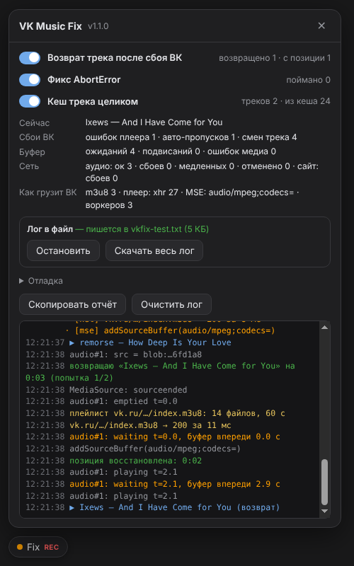

# VK Music Fix

Неофициальное расширение для Chrome / Edge. Чинит самопроизвольные скипы и подвисания музыки в веб-версии ВКонтакте (vk.ru / vk.com).

Разрешений не требует, ничего никуда не отправляет, работает только на страницах ВК.

> Проект не связан с VK. Это пользовательский обходной путь, пока баг не исправлен на стороне сайта.

## Проблема

С сентября 2026 года музыка в веб-версии ВК работает так:

- при запуске трека плеер сам пролистывает несколько треков подряд (бывает 10–15) и останавливается на случайном;
- этот трек доигрывается, а на следующем всё повторяется;
- воспроизведение периодически подвисает и лагает.

В консоли браузера (F12 → Console) в это время сыпется:

```
AbortError: The play() request was interrupted by a new load request.
AbortError: The play() request was interrupted by a call to pause().
ErrorLogger-plugin: Unknown error
```

## Почему так происходит

Если смотреть снаружи, сбоев два, и они усиливают друг друга:

1. **Прерванный запуск считается битым треком.** Плеер вызывает `play()`, почти сразу перезагружает источник или ставит паузу, получает `AbortError` и переключается на следующий трек. На следующем повторяется то же самое, отсюда цепочка скипов.
2. **После внутренней ошибки плеер включает следующий трек.** Модуль HLS-воспроизведения иногда падает с «Unknown error». В ответ плеер не пробует ещё раз, а включает следующий трек.

## Что делает расширение

| Функция | Что происходит |
|---|---|
| **Возврат трека после сбоя** | Замечает, что трек переключился сам сразу после ошибки плеера. Возвращает упавший трек и перематывает на место обрыва. Если один трек падает третий раз подряд, отпускает его, чтобы не зациклиться. |
| **Фикс AbortError** | Прерванный `play()` больше не превращается в «трек битый → следующий». Трек доигрывается. |
| **Кеш трека целиком** | Как только плеер запросил плейлист `.m3u8`, все его сегменты качаются заранее, параллельно и с повторами при обрывах. Плееру они отдаются из памяти. Ничего не расшифровывается и не сохраняется на диск: плеер получает те же байты, что получил бы из сети. Если сервер тормозит, плеер не ждёт кеш дольше 3 с и качает сам, а зависший сервер не блокирует другие треки. |
| **Отладка** | Панель «Fix» внизу слева (или `Alt+Shift+D`): статистика сбоев, сети и буфера, подсказки, живой лог, запись лога в файл, полный лог за прошлые сессии. |

Каждую функцию можно выключить тумблером в панели.



## Установка

### Windows, быстро

1. Скачай архив: **Code → Download ZIP** или последний релиз в **Releases**. Распакуй его.
2. Запусти `INSTALL.bat`. Он скопирует расширение в `%LOCALAPPDATA%\VKMusicFix`, положит путь в буфер обмена и откроет страницу расширений Chrome.
3. Включи **«Режим разработчика»** → **«Загрузить распакованное расширение»** → в окне выбора папки вставь путь (Ctrl+V) → **«Выбор папки»**.
4. Обнови вкладку с ВК. Внизу слева появится кнопка **Fix**.

### Вручную (любая ОС)

`chrome://extensions` (в Edge: `edge://extensions`) → «Режим разработчика» → «Загрузить распакованное расширение» → выбери папку `extension` из репозитория.

### Обновление

Скачай новую версию, снова запусти `INSTALL.bat` и нажми ↻ на карточке VK Music Fix. Если ставил вручную, замени файлы в папке и нажми ↻.

## Если не помогло

1. Открой панель **Fix** → **«Писать в файл…»** и выбери, куда сохранять лог.
2. Слушай музыку, пока не поймаешь пару скипов.
3. Создай [Issue](../../issues) и приложи файл лога.

В лог попадают:

- для каждой ошибки плеера: позиция в треке, сколько секунд загружено вперёд, состояние плеера;
- сетевые запросы и события MediaSource за несколько секунд до сбоя.

Параметры ссылок (подписи и токены) из лога вырезаются автоматически. Названия треков и адрес страницы остаются, так что перед публикацией проверь, что тебя это устраивает.

## Как устроено

```
extension/
├── manifest.json   Manifest V3, без permissions, content script только на vk.ru / vk.com
├── fix.js          ядро: world MAIN, run_at document_start
└── panel.js        панель в Shadow DOM, не конфликтует со стилями сайта
INSTALL.bat         установка/обновление на Windows
```

`fix.js` запускается раньше скриптов сайта и:

- оборачивает `HTMLMediaElement.prototype.play` и проглатывает только `AbortError`, остальные ошибки пропускает как есть;
- перехватывает `XMLHttpRequest` и `fetch`: разбирает `.m3u8`, заранее качает сегменты и отдаёт их плееру из памяти. Остальные запросы сайта не трогает;
- следит за сменой трека по DOM и за `console.error` плеера. Когда трек переключился сам сразу после ошибки, нажимает «назад» и восстанавливает позицию;
- пишет лог в IndexedDB (до 50 000 строк). По кнопке ведёт параллельную запись в выбранный файл через File System Access API.

Требования: Chrome / Edge 111+ (нужен `world: "MAIN"` для content scripts).

## Лицензия

[MIT](LICENSE)
